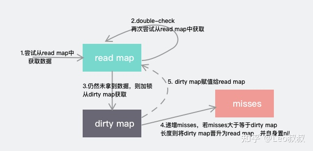

# EXPLAIN

## 从第100万行数据开始取10条数据”的需求
    WITH cte AS (
         SELECT *, ROW_NUMBER() OVER (ORDER BY id) AS row_num
         FROM table_name
     )
     SELECT * 
     FROM cte 
     WHERE row_num BETWEEN 1000001 AND 1000010

## 联合索引
    a b
    where a         能命中
    where b         不能命中
    where b and a   能命中，不如where a
    where a or b    不能命中 (单独索引的a,b能命中 但是多or一个c则不能命中)
    优化
    全连接
    (*** where a)
    union all
    (*** where b)

    使用IN或EXISTS：
    将OR条件转化为IN或EXISTS子查询，有时可以促使优化器做出更有效的决策。
    
    SELECT * FROM your_table
    WHERE a IN (some_value)
    OR EXISTS (SELECT 1 FROM your_table t2 WHERE t2.b = another_value AND t2.id = your_table.id)

### 索引失效场景
    like查询以%开头，会导致索引失效。可以有两种方式优化：

    a. 使用覆盖索引优化，只查询索引列；
    b. 把%放后面，索引生效 
    or 中有没有索引的列

    主键字段中使用not in关键字查询数据范围，任然可以走索引。
    而普通索引字段使用了not in关键字查询数据范围，索引会失效 

    a. 当我们创建一个联合索引的时候，如(a,b,c)，相当于创建了（a）、(a,b)和(a,b,c)三个索引，这就是最左匹配原则；
    b. 联合索引不满足最左原则，索引一般会失效，第四种情况命中索引是因为查询列覆盖索引。 
    件字段中使用MySQL内置函数，导致索引失效 
    索引列进行计算导致索引失效

    a. 对于不等于的优化，如果数据量较大可以考虑反向操作优化；
    b. 对于not in 优化，可以采用left join 和 右表.id is null 方法优化。 

    在sql中做表关联时，需要注意两边字段的编码要保持一致。 

    由于使用order by 需要对全表数据进行排序，因此会索引失效，但是有个特例，
    如果order by 后面跟的是主键，也会走索引，有时候也与mysql的优化器有关。

## B+树
    高度在3-5之间。

    InnoDB存储引擎的B+树的树高通常是比较小的，通常在3-4层左右。这是因为InnoDB存储引擎采用了很多优化策略来减小B+树的高度。其中包括：
    
    聚簇索引：InnoDB存储引擎的聚簇索引是按照主键进行组织的，这样可以避免在非聚簇索引中再次存储主键，从而减小了B+树的高度。
    页分裂：当B+树中的某个页面已经满了时，InnoDB存储引擎会对该页面进行分裂，以保证B+树的平衡性。
    页合并：当B+树中某些叶子节点的空间利用率较低时，InnoDB存储引擎会将这些节点合并成一个更大的节点，以减小B+树的高度。
    自适应哈希索引：在InnoDB存储引擎中，如果某个表的某些查询经常使用某个非聚簇索引，那么InnoDB会自动为该索引创建哈希索引，从而提高查询效率。
    这些优化策略的使用可以使得InnoDB存储引擎的B+树的高度通常比较小，从而提高数据库的查询效率。

    在InnoDB里，每个页面默认16KB，假设主键是4B的int类型。对于中间节点，每个主键值后有个页号4B，还有6B的其他数据(参考《MySQL技术内幕：InnoDB存储引擎》)，
        那么扇出系数k=16KB/(4B+4B+6B)≈1170。我们再假设每行记录大小为1KB，则每个叶子结点可以容纳的记录数n=16KB/1KB=16。

    在高度h=3时，叶子结点数=1170^2 ≈137W，总记录数=1170^2*16=2190W！！也就是说，InnoDB通过三次索引页面的I/O，即可索引2190W行记录。
    同理，在高度h=4时，总行数=1170^3*16≈256亿条！！！
